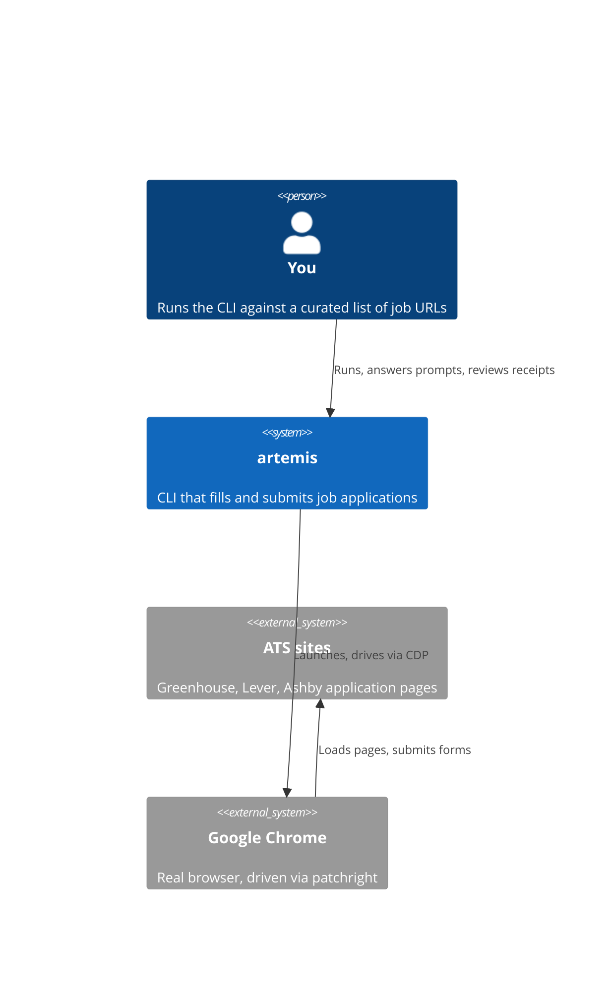
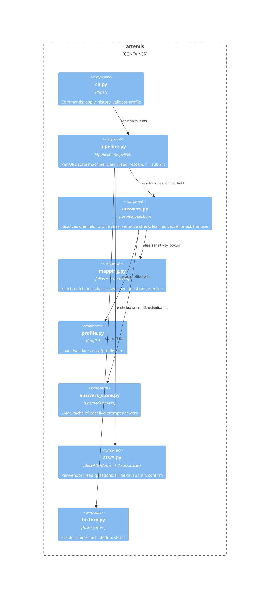
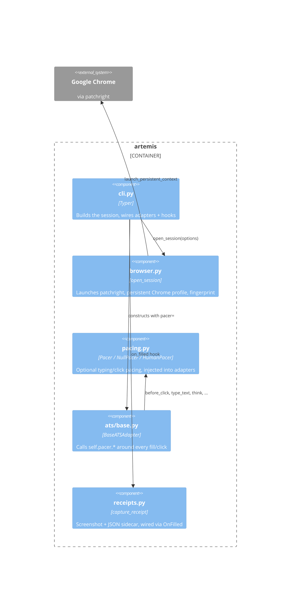

# Architecture

C4 diagrams for artemis: system context, then component-level detail for the
two halves of the codebase. See `CLAUDE.md` for the code tour; this is the
picture to navigate from.

## System Context

Everything lives in one local process. There's no server, no database
beyond a local SQLite file, and no network calls except the browser loading
real ATS pages.

## Components: request flow

`cli.py` and `pipeline.py` are the core; everything else is a dependency it
calls into per URL. See `pipeline.py`'s `ApplicationPipeline._process_url`
for the exact sequence.

## Components: browser execution layer

`pipeline.py` calls `ats/base.py` methods with a `page` object; where that
page comes from, and how it behaves, is this layer. `cli.py` wires it
together and is the only caller.

## Navigating from here

- Follow a real run: `cli.py:apply` → `pipeline.py:ApplicationPipeline._process_url`.
- Add a new ATS vendor: `ats/greenhouse.py` is the shortest example to copy.
- Change how a field gets answered: `answers.py:resolve_question`.
- Change browser/stealth behavior: `browser.py`, `pacing.py`.
