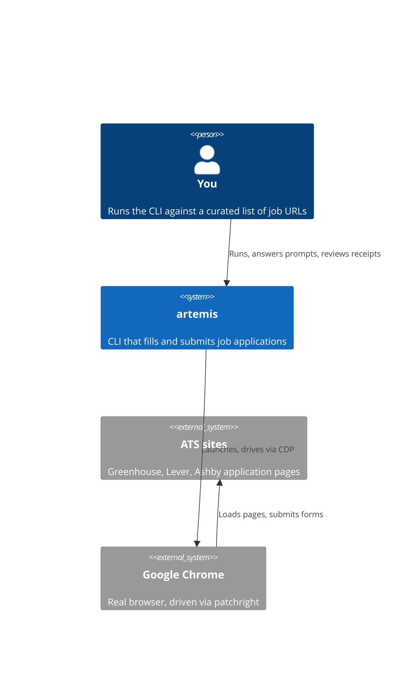
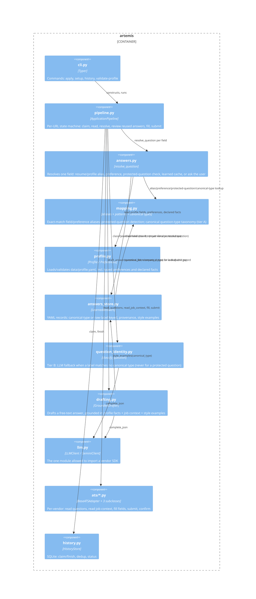
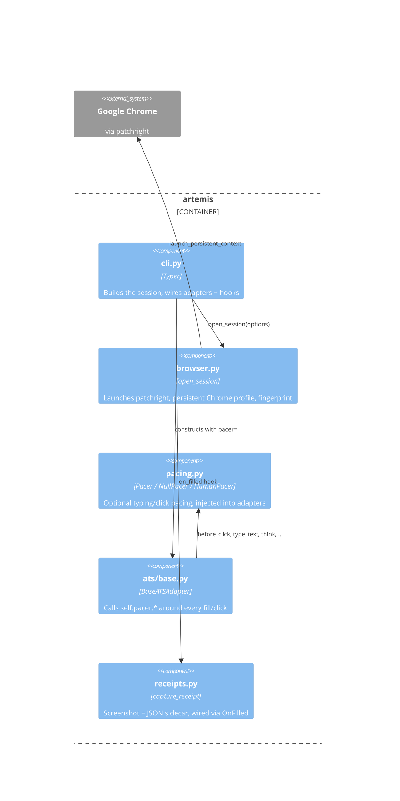
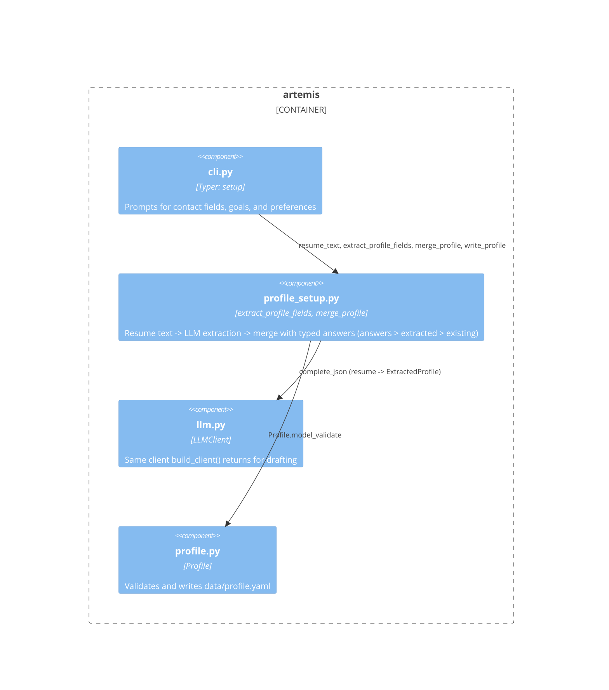

# Architecture

C4 diagrams for artemis: system context, then component-level detail for the
`apply` request flow, the browser execution layer, and `artemis setup`. See
`CLAUDE.md` for the code tour; this is the picture to navigate from.

## System Context

```mermaid
C4Context
    Person(user, "You", "Runs the CLI against a curated list of job URLs")

    System(artemis, "artemis", "CLI that fills and submits job applications")

    System_Ext(ats, "ATS sites", "Greenhouse, Lever, Ashby application pages")
    System_Ext(chrome, "Google Chrome", "Real browser, driven via patchright")

    Rel(user, artemis, "Runs, answers prompts, reviews receipts")
    Rel(artemis, chrome, "Launches, drives via CDP")
    Rel(chrome, ats, "Loads pages, submits forms")
```

Everything lives in one local process. There's no server, no database
beyond a local SQLite file, and no network calls except the browser loading
real ATS pages.

## Components: request flow

`cli.py` and `pipeline.py` are the core; everything else is a dependency it
calls into per URL. See `pipeline.py`'s `ApplicationPipeline._process_url`
for the exact sequence.

A field resolved from the profile (contact alias, declared value, preference)
fills without a live look -- the person already reviewed it once, when they
wrote it into `profile.yaml`. A field resolved from the learned-answers store
always goes back to the person for a quick confirm first (`pipeline.py`'s
`for_review` bucket): it was approved for a *different* application, not this
one. Only a genuinely unresolved question is offered an LLM draft.

```mermaid
C4Component
    Container_Boundary(artemis, "artemis") {
        Component(cli, "cli.py", "Typer", "Commands: apply, setup, history, validate-profile")
        Component(pipeline, "pipeline.py", "ApplicationPipeline", "Per-URL state machine: claim, read, resolve, review reused answers, fill, submit")
        Component(answers, "answers.py", "resolve_question", "Resolves one field: resume/profile alias, preference, protected-question check, learned cache, or ask the user")
        Component(mapping, "mapping.py", "aliases + patterns + canonical types", "Exact-match field/preference aliases; protected-question detection; canonical question-type taxonomy (tier A)")
        Component(profile, "profile.py", "Profile / Preferences", "Loads/validates data/profile.yaml, incl. typed preferences and declared facts")
        Component(store, "answers_store.py", "LearnedAnswers", "YAML records: canonical-type or raw-label keyed, provenance, style examples")
        Component(identity, "question_identity.py", "classify_question", "Tier B: LLM fallback when a label matches no canonical type (never for a protected question)")
        Component(drafting, "drafting.py", "GroundedDrafter", "Drafts a free-text answer, grounded in profile facts + job context + style examples")
        Component(llm, "llm.py", "LLMClient / GeminiClient", "The one module allowed to import a vendor SDK")
        Component(adapters, "ats/*.py", "BaseATSAdapter + 3 subclasses", "Per-vendor: read questions, read job context, fill fields, submit, confirm")
        Component(history, "history.py", "HistoryStore", "SQLite: claim/finish, dedup, status")
    }

    Rel(cli, pipeline, "constructs, runs")
    Rel(pipeline, answers, "resolve_question per field")
    Rel(answers, mapping, "alias/preference/protected-question/canonical-type lookup")
    Rel(answers, profile, "read profile fields, preferences, declared facts")
    Rel(answers, store, "read learned answers (never for a protected question)")
    Rel(store, mapping, "canonical_form/canonical_type on lookup and record")
    Rel(pipeline, identity, "classify a novel label (tier B, not yet wired to resolution)")
    Rel(identity, llm, "complete_json")
    Rel(pipeline, drafting, "draft_answer(question, job, company_notes) for a draftable gap")
    Rel(drafting, store, "style_examples(canonical_type)")
    Rel(drafting, llm, "complete_json")
    Rel(pipeline, adapters, "read_questions, read_job_context, fill, submit")
    Rel(pipeline, history, "claim, finish")
```

## Components: browser execution layer

`pipeline.py` calls `ats/base.py` methods with a `page` object; where that
page comes from, and how it behaves, is this layer. `cli.py` wires it
together and is the only caller.

```mermaid
C4Component
    Container_Boundary(artemis, "artemis") {
        Component(cli, "cli.py", "Typer", "Builds the session, wires adapters + hooks")
        Component(browser, "browser.py", "open_session", "Launches patchright, persistent Chrome profile, fingerprint")
        Component(pacing, "pacing.py", "Pacer / NullPacer / HumanPacer", "Optional typing/click pacing, injected into adapters")
        Component(adapters, "ats/base.py", "BaseATSAdapter", "Calls self.pacer.* around every fill/click")
        Component(receipts, "receipts.py", "capture_receipt", "Screenshot + JSON sidecar, wired via OnFilled")
    }

    System_Ext(chrome, "Google Chrome", "via patchright")

    Rel(cli, browser, "open_session(options)")
    Rel(browser, chrome, "launch_persistent_context")
    Rel(cli, adapters, "constructs with pacer=")
    Rel(adapters, pacing, "before_click, type_text, think, ...")
    Rel(cli, receipts, "on_filled hook")
```

## Components: profile setup

`artemis setup` is a separate flow from `apply` -- no browser, no ATS. All
interactive prompting lives in `cli.py`; `profile_setup.py` stays pure and
testable without a live API key (see its own module docstring).

```mermaid
C4Component
    Container_Boundary(artemis, "artemis") {
        Component(cli2, "cli.py", "Typer: setup", "Prompts for contact fields, goals, and preferences")
        Component(setup, "profile_setup.py", "extract_profile_fields, merge_profile", "Resume text -> LLM extraction -> merge with typed answers (answers > extracted > existing)")
        Component(llm2, "llm.py", "LLMClient", "Same client build_client() returns for drafting")
        Component(profile2, "profile.py", "Profile", "Validates and writes data/profile.yaml")
    }

    Rel(cli2, setup, "resume_text, extract_profile_fields, merge_profile, write_profile")
    Rel(setup, llm2, "complete_json (resume -> ExtractedProfile)")
    Rel(setup, profile2, "Profile.model_validate")
```

## Navigating from here

- Follow a real run: `cli.py:apply` → `pipeline.py:ApplicationPipeline._process_url`.
- Add a new ATS vendor: `ats/greenhouse.py` is the shortest example to copy.
- Change how a field gets answered: `answers.py:resolve_question`.
- Add or edit a recurring question type: `mapping.py`'s `CANONICAL_PHRASES`/`CANONICAL_TYPES`.
- Change what a drafted answer can see: `drafting.py:build_prompt`, `ats/base.py:JobContext`.
- Change browser/stealth behavior: `browser.py`, `pacing.py`.
- Follow `artemis setup`: `cli.py:setup` → `profile_setup.py:merge_profile`.
